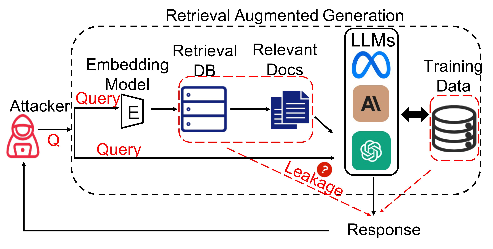

# Literature survey of the attacks on RAG enabled LLMs

we will start with a literature survey of the attacks on RAG enabled LLMs to identify state of the art threat vectors. We will then <u>prioritize</u> them based on potential harm along with our industry collaborators then <u>develop testing tools and defenses</u> for the top few threats.

## 1. The Good and The Bad: Exploring Privacy Issues in Retrieval-Augmented Generation (RAG)

### RAG Components:

LLM: Llama-7b-chat(L7C), Llama- 13b-chat(L13C), and GPT-3.5-turbo(GPT). 

Embedding models: bge-large-en-v1.5, all-MiniLM-L6-v2 and e5-base-v2 

Construct the Retrieval database and store embeddings: Chroma2 

similarity metrix: L2-norm. 

The number of retrieved documents per query was set to k = 2

#### Data: 

two datasets as retrieval data: the Enron Email dataset of 500,000 employee emails, and the HealthcareMagic-101 dataset of 200k doctor-patient medical dialogues. For the HealthcareMagic dataset, we construct each doctor- patient medical dialogue as a data piece embedded and stored in a vector database, while for the Enron Email, we construct each email as a data piece.

#### Metrics:

For both attacks, we report the total number of contexts fetched (**Retrieval Contexts**), the number of prompts yielding outputs with at least 20 direct tokens from the dataset (**Repeat Prompts**), and the number of unique direct excerpts produced (**Repeat Contexts**). For targeted attacks, we re- port the extracted targeted information (**Targeted Information**). For untargeted attacks, we report the number of prompts generating outputs with a ROUGE-L score over 0.5 (**Rouge Prompts**), and the total number of unique outputs closely resembling the retrieval data (**Rouge Contexts**).

#### Privacy Risks in RAG

- **Data Leakage:** Potential for sensitive information to be inadvertently exposed through the retrieval process.
- **User Privacy:** Risks associated with using personal data in both the training and retrieval stages, leading to unintended disclosure.
- **Security Vulnerabilities:** Exposure to unauthorized access and exploitation if retrieval systems are compromised.

#### Mitigation Strategies

- **Data Anonymization:** Techniques to anonymize sensitive information to protect user privacy.
- **Access Control Mechanisms:** Implementing robust access controls to restrict retrieval of sensitive data to authorized personnel only.
- **Enhanced Security Protocols:** Adoption of advanced security measures to safeguard against unauthorized access and data breaches.

#### Future Research Directions

- **Privacy-Preserving Techniques:** Need for ongoing research to develop more effective methods for protecting privacy in RAG systems.
- **Regulatory Frameworks:** Importance of establishing clear policies and regulations to govern the use of RAG and ensure user privacy.
- **Technological Innovations:** Exploration of new technologies to enhance both the functionality and security of RAG systems.

## Prompt Perturbation in Retrieval-Augmented Generation based Large Language Models

https://arxiv.org/pdf/2402.07179

GGPP

1.**Gradient Computation**: Compute the gradient of the model's loss function with respect to the input prompt. This identifies sensitive parts of the prompt that significantly impact the model's output.

2.**Perturbation Generation**: Use the computed gradients to create small but targeted changes (perturbations) in the prompt. These changes are crafted to maximize the model's prediction errors.

3.**Prefix Insertion**: Add these perturbations as prefixes to the original prompt, subtly altering the input in a way that misleads the model.

Defence of GGPP:

1.**Prompt Preprocessing**: Techniques to sanitize and normalize prompts before they are fed into the model.

2.**Anomaly Detection**: Methods to identify and filter out perturbed prompts by monitoring abnormal changes in model neuron activation patterns.

3.**Adversarial Training**: Training the model with adversarially perturbed prompts to enhance its robustness.

Experiments:

1. Prompt Preprocessing

- Outcome: Normalization techniques, such as spelling correction and synonym replacement, significantly improved the model's performance. The accuracy and F1 scores saw noticeable gains, indicating effective mitigation of perturbations.

2. Anomaly Detection

- Outcome: Implemented detection methods accurately identified perturbed prompts with high precision and recall. The ROC-AUC scores demonstrated strong performance in distinguishing between normal and perturbed prompts.

3. Adversarial Training

- Outcome: Models trained with adversarial examples exhibited enhanced robustness. They maintained higher accuracy and performance metrics when tested on both clean and adversarial prompts compared to models trained solely on clean data.

RAG Interface - Verba: The Golden RAGtriever  https://github.com/weaviate/Verba

## 2. Benchmarking LLMs in RAG: 

 https://github.com/chen700564/RGB

Evaluate the performance of various LLMs, analyze and discuss the results, summarizing the main challenges that existing LLMs encounter when using external knowledge.

#### Methodology:

6 Models: Generate both English and Chinese including ChatGPT (OpenAI 2022)3 , ChatGLM-6B (THUDM 2023a), ChatGLM2-6B (THUDM 2023b), Vicuna-7b-v1.3 (Chiang et al. 2023), Qwen-7BChat (QwenLM 2023), BELLE-7B-2M (Yunjie Ji 2023).

manually modify the external document as result of RAG, and then evaluate whether LLMs can utilize the provided external documents to acquire knowledge and generate reasonable answers.

## 3. HarmBench:

A Standardized Evaluation Framework for Automated Red Teaming and Robust Refusal https://github.com/centerforaisafety/HarmBench

18 ways of attacks and use classifier model https://huggingface.co/cais/HarmBench-Llama-2-13b-cls or https://huggingface.co/cais/HarmBench-Llama-2-13b-cls to label whether each completion is an example of its corresponding behavior

## 4. Developed by GovTech and has some pointers on evaluation

 public service app https://go.gov.sg/rag-playbook

simply uploading raw data to cloud storage and selecting some application parameters. The managed service will build the RAG application end-to-end, from data processing to deployment.

## 5. Project Moonshot - AI Verify

https://aiverifyfoundation.sg/project-moonshot/

https://github.com/aiverify-foundation/moonshot-data/tree/main/attack-modules

### The red teaming capabilities

**Character Swap Attack**

This module tests for adversarial textual robustness. It creates perturbations through swapping characters for words that contain more than 3 characters.

**Toxic Sentence Generator**

This module generates toxic sentences based on a given seed prompt, testing if the system under test will complete the sentence with toxic sentences/phrases.

**TextBugger Attack**

This module tests for adversarial textual robustness and implements the perturbations listed in the TEXTBUGGER paper.

**Job Role Generator Module**

This attack module adds demographic groups to the job role.

**Homoglyph Attack**

This module tests for adversarial textual robustness using homoglyphs, which are alternative words for words comprising of ASCII characters.

**Violent Durian**

A multi-turn agent designed to interact over several exchanges, used to elicit dangerous or violent suggestions from the target language model by adopting a criminal persona.

**TextFooler Attack**

This module tests for adversarial textual robustness and implements the perturbations listed in a paper on BERT's robustness.

**Colloquial Wordswap Attack**

This attack module tests for textual robustness against the Singapore context by substituting certain nouns with their Singapore colloquial counterparts.

**Insert Punctuation Attack**

This module tests for adversarial textual robustness and creates perturbations through adding punctuation to the start of words in a prompt.

**Malicious Question Generator**

This attack module generates malicious questions using OpenAI's GPT4 based on a given topic.

**Sample Attack Module**

This is a sample attack module.

**Singapore Sentence Generator**

This module generates Singlish sentences based on a given seed prompt to test if the endpoint will complete the sentence with toxic sentences/phrases in the Singapore context.

## 6. From Stanford - Legal RAG hallucinations

How RAG systems still hallucinate

https://dho.stanford.edu/wp-content/uploads/Legal_RAG_Hallucinations.pdf

1. to assess and report the performance of RAG-based proprietary **legal** AI tools. 

2. it introduces a comprehensive, preregistered dataset for identifying and understanding vulnerabilities in these systems. 
3. it proposes a clear typology for differentiating between hallucinations and accurate legal responses. 
4. it provides evidence to inform the responsibilities of legal professionals in supervising and verifying AI outputs, which remains a central open question for the responsible integration of AI into law.

Focus on ***factual* hallucinations** (*correctness* and *groundedness*) or the tendency of AI tools to produce outputs that are demonstrably false: it can be unfaithful to its training data, unfaithful to its prompt input, or unfaithful to the true facts of the world

considered ***hallucinated*** if it is either **incorrect or misgrounded** (false statement or falsely asserts that a source supports a statement)

Limitation of RAG:

Many popular LLM benchmarking datasets contain questions with clear, unambiguous references that address the question in the source database. Legal queries, however, often do not admit a single, clear-cut **answer**: legal opinions are not atomic *facts* and At best, a RAG system must be able to locate information from multiple sources across time and place

document relevance not only about text relevancy 

#### Methodology:

**RAG-based AI research tools:** 

LexisNexis’s Lexis+ AI, Thomson Reuters’s Ask Practical Law AI, and Westlaw’s AI-Assisted Research. GPT-4’s responses produced without access to an external knowledge base.

design a diverse set of legal queries

1. it is expressly designed to move the evaluation of AI systems from standard question-answer settings with a discrete and known answer (e.g., multiple choice) to the generative (e.g., open-ended) setting

2. Second, our queries are specifically tailored to RAG-based, open-ended legal research tools.
3. ...

Executed manually

## Improved Techniques for Optimization-Based Jailbreaking on Large Language Models

https://arxiv.org/pdf/2405.21018

### Universal and Transferable Attacks on Aligned Language Models: GCG

https://github.com/llm-attacks/llm-attacks

### Background

### Method

## Improved Few-Shot Jailbreaking Can Circumvent Aligned Language Models and Their Defenses 

https://github.com/sail-sg/I-FSJ

# RAG Attacks

## Prompt Injection Attack

RAG utilizes a vector database to hold a large amount of data that the LLM may not have seen during training. This allows the model to cite data sources, provide better-supported responses, or be customized for different enterprises. The adversary may prompt inject some of the documents included in the database, and the attack activates when the model reads those documents. https://github.com/protectai/llm-guard/blob/main/docs/input_scanners/prompt_injection.md

`OWASP Top 10 LLM attacks` https://owasp.org/www-project-top-10-for-large-language-model-applications/

